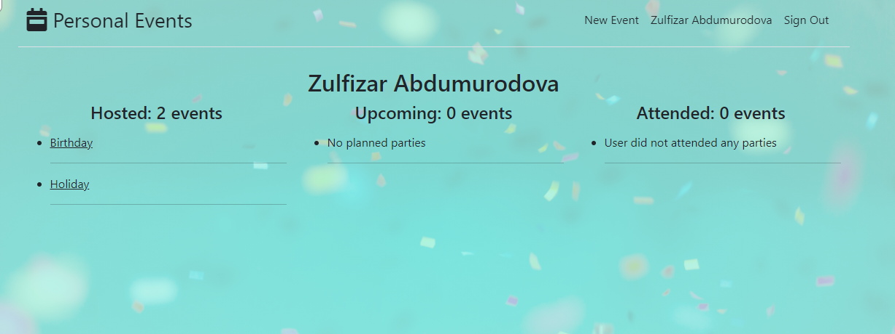
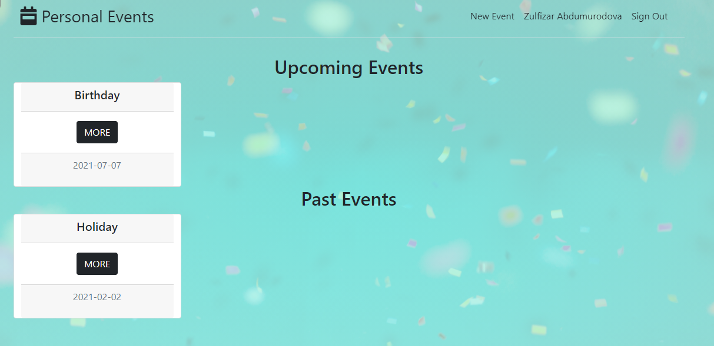

# Personal Events

> This special app that has been created with help of rails to create events and show them in sorted way. The learning aim is to implement associations, show User's events show page (seperated hosted events, attended events and upcoming events), and events' show page (seperated upcoming and past events)

There you can see images of live version.

## Built With

- <code></code> Ruby Language  
-  <code></code> Ruby on Rails  
- &nbsp; Git 
- &nbsp; GitHub 
- &nbsp; VScode

## Getting Started

### Prerequisites
- Node
- Rails
- Yarn
- Git
- Node

#### Clone this repository on to your local PC

- Click on the `Code` green button
- By the right end of the read-only input containing the repository link click the clipboard icon to copy the link
- In your local PC, open your terminal in the folder you would like to clone the repository into
- Clone the repository with the command: `git clone (copied link)`; like so: `git clone https://github.com/AbdumurodovaZulfizar/PrivateEvents`
- After the clone, type in the command `cd PrivateEvents` to access the directory on the terminal
- And type `bundle install` to load all gems in this folder.
- After run `rails db:migrate` for migration.
- Type `rails s` on the terminal, and type `localhost:3000` on your browser.
- And then you can Sign In.

## Authors

👩🏻‍💼 **Zulfizar Abdumurodova**

- GitHub: [Abdumurodova Zulfizar](https://github.com/AbdumurodovaZulfizar)
- Twitter: [Abdumurodova Zulfizar](https://twitter.com/Zulfiza70357085)
- LinkedIn: [Abdumurodova Zulfizar](https://www.linkedin.com/in/zulfizar-abdumurodova-a61527206/)

## 🤝 Contributing

Contributions, issues, and feature requests are welcome!

Feel free to check the [issues page](https://github.com/AbdumurodovaZulfizar/PrivateEvents/issues/1).

## Show your support

Give a ⭐️ if you like this project!

## Acknowledgments

- [Microverse](https://www.microverse.org/) for international opportunities.
- Special thanks to all code reviewers.
- AppAcademy and FreeCodeCamp for their open source

## 📝 License

Copyright 2021 Zulfizar Abdumurodova
- [MIT](https://github.com/AbdumurodovaZulfizar/PrivateEvents/blob/create_app/LICENSE) for this project.
